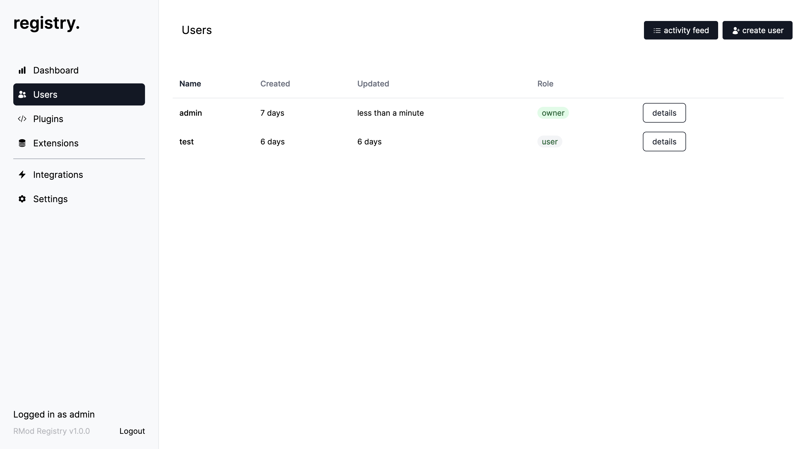
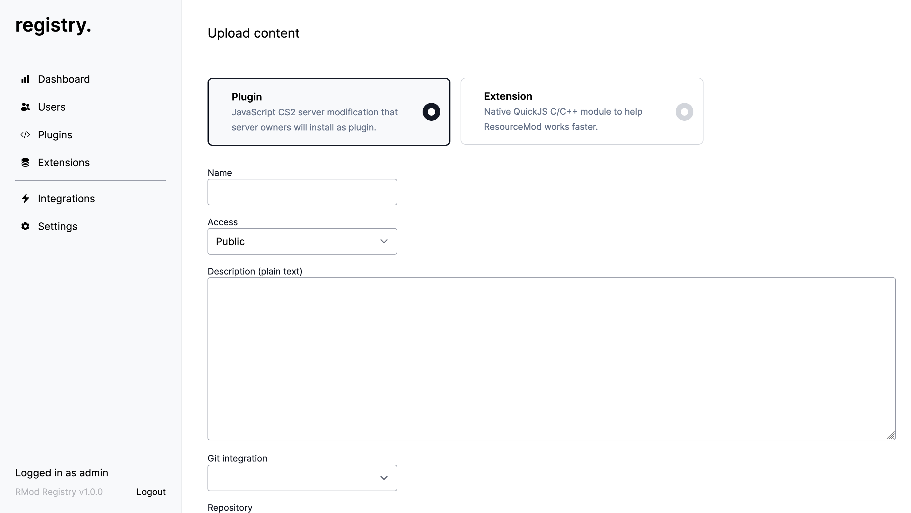
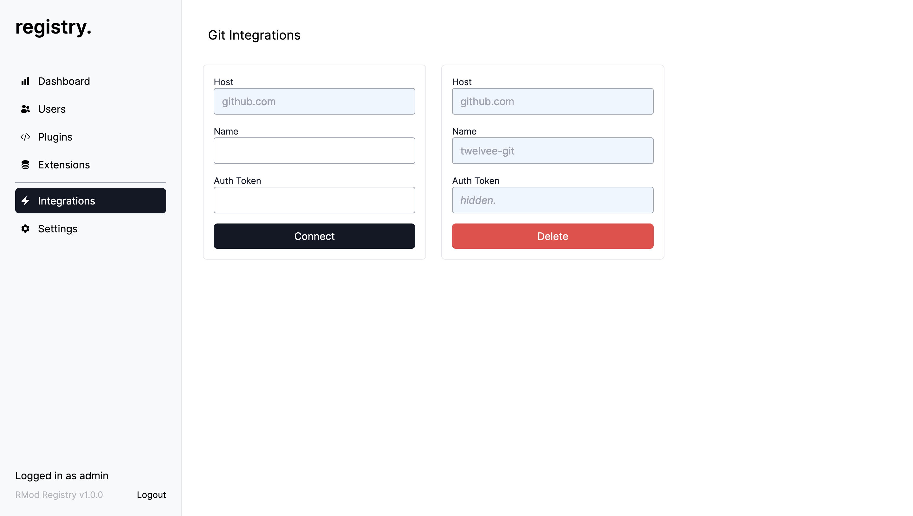

#### What's that?
ResourceMod content registry is a self-hosted solution to host your plugins and extensions for cs2 game servers.

#### Why is this necessary?
At release, we will create our own instances of the same registry that will allow content creators to host their plugins on our servers, or rather give us the ability to share plugins via the package manager. But some content creators are worried about keeping their data private, or don't want to share plugins with other users at all, in which case you will need a registry. For clarity, you can draw an analogy with docker registry, the meaning is the same, adding content to the game server will be done through similar servers proxy, which will allow you to control access to these resources.

#### Where is the content stored?
Git. GitHub to be exact. Your plugins or extensions can be in public repositories or private, registry will be able to download them either way using the GitHub integration.

#### How's that works?
You deploy a docker image or use a binary file to run the REST API of the registry server. You can also implement the Registry specification in any other language or framework, the current specification can be found under /api folder.

#### Web UI
We have created a web interface to make it easy to work with the registry. Through web-ui you can create your account, manage users, add plugins, add extensions (c-modules), manage integrations with git.






#### How to build
1. Pull repository
2. Install golang (tested on 1.19, would be nice to update it)
3. Install make
4. Run make build

#### How to generate API from openapi specification
Run `make generate-api`

#### How to contribute
1. Create an issue
2. Fork repository
3. Do your work
4. Create a pull-request attached to the issue

#### How to run it?
Build and run it by binary (/bin/rmod-reg)

Or you can run it via docker image.
```
docker run -e DB_DSN=mongodb://host:port -e JWT_SECRET_KEY=*your_secret_jwt_key* -e CONTENT_DATA_FOLDER=/data -p 8888:8888 -v ${PWD}/runtime_data:/data resourcemod/rmod-registry:v1.0.0 rmod-reg serve 
```

#### Env variables
1. JWT_SECRET_KEY (jwt secret key)
2. DB_DSN (mongodb dsn)
3. CONTENT_DATA_FOLDER (folder with content cache)
4. IS_DEV (provide cors to localhost:3000)

#### rmod-reg serve command flags
1. host (default: 0.0.0.0)
2. port (default: 8888)
3. ui (enable/disable web-ui, default: true)
4. static (web ui static folder, default: "./web/app/dist")

#### Roadmap
- [x] Users management
- [x] Content management
- [x] GitHub integrations management
- [ ] Correct JWT workflow (token validation)
- [ ] Code refactoring and code quality tools
- [ ] Private plugins/extensions download support
- [ ] Settings

#### We use
1. MongoDB as main database
2. Gin http server framework
3. Docker
4. OpenAPI specifications

#### Docker Hub
https://hub.docker.com/r/resourcemod/rmod-registry